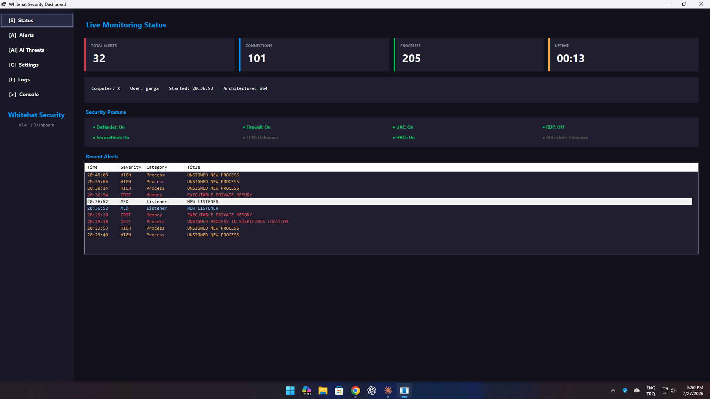
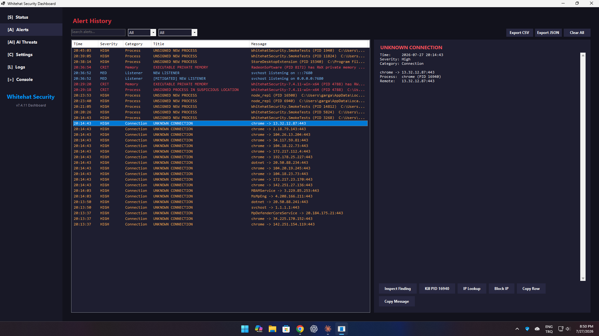
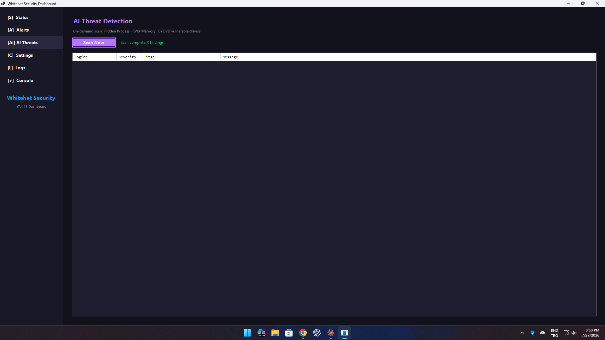

# All-in-One Whitehat Security Tool

A real-time Windows security monitoring tool written in C# / .NET 8 / WinForms. Compiles to a single self-contained `.exe`.

## Screenshots

### Live Monitoring Status

Alert counter, connection and process counts, uptime, and a security-posture row covering Defender, Firewall, UAC, RDP, Secure Boot, TPM, HVCI and BitLocker.



### Alert History

Every finding with severity, category and message, searchable and filterable, exportable to CSV or JSON. Selecting a row opens the detail pane, whose action strip offers exactly the responses that apply to that finding — here a connection alert offers Inspect Finding, Kill PID, IP Lookup, Block IP, Copy Row and Copy Message. Alerts already dealt with are marked `[MITIGATED]`. History is written to disk, so it survives restarts.



### AI Threat Detection

On-demand scan across the three behavioural engines: hidden processes, executable private (RWX) memory, and loaded drivers matching known bring-your-own-vulnerable-driver names.



This repository previously also contained a PowerShell implementation (`SecurityMonitor.ps1`) plus an experimental C kernel driver. Both have been removed — only the C# version remains. The C# version avoids PowerShell-specific AMSI heuristics that the script implementation triggered because of its plaintext attack-tool name lists, hidden-window plus execution-policy-bypass combination, and download-cradle install pattern.

A compiled `.exe` reduces those script-specific triggers; endpoint security products can and should still scan the resulting binary:

| Old PowerShell problem | How the compiled `.exe` solves it |
|------------------------|-----------------------------------|
| AMSI scans PowerShell source for malware substrings | No PowerShell monitor script; endpoint protection still scans the binary |
| Each pattern becomes part of the PowerShell token stream | Detection logic is compiled into the application assembly |
| Long-running `-ExecutionPolicy Bypass -WindowStyle Hidden` monitor flagged | Native monitoring engines; short elevated PowerShell helpers run only after an explicit admin setting change |
| Persistence + download + hidden window in one script = `Heur.Boxter` | Single binary, no install cradle |
| Script parsing on every run | Compiled application startup |
| End user has to allow PowerShell execution policy | End user just runs `WhitehatSecurity.exe` |

## Build

Requires the **.NET 8 SDK** (https://dotnet.microsoft.com/download — `winget install Microsoft.DotNet.SDK.8`).

```pwsh
dotnet build -c Release
```

Single-file self-contained release (one `.exe`, no .NET runtime needed on the target machine):

```pwsh
dotnet publish -c Release -r win-x64 --self-contained
```

The published binary lives at `bin\Release\net8.0-windows\win-x64\publish\WhitehatSecurity.exe`.

Run the Windows smoke-test harness:

```pwsh
dotnet run --project tests\WhitehatSecurity.SmokeTests -c Release
```

## Install / Uninstall

The `.exe` is its own installer. Just download `WhitehatSecurity.exe` from the latest release and double-click it:

- **First run from outside Program Files**: a small dialog asks whether you want to install system-wide. Yes → triggers UAC, then:
  - copies the `.exe` to `C:\Program Files\Whitehat Security\`
  - registers in Windows **Apps & Features**
  - creates a **Start Menu** shortcut
  - creates a shortcut on **the user's Desktop** (handles OneDrive Known Folder Move) and on the **Public Desktop**
  - adds an **HKLM\…\Run** entry so the program **auto-starts at every logon** in tray-only mode (`--silent`)
- **Updating**: run a newer `.exe` from outside the install directory. It compares its own version with the copy in `C:\Program Files\Whitehat Security\` and offers to update it; accepting stops the running installed instance, replaces the binary, and restarts it in tray mode. Answering *No* runs the new copy portably and leaves the installed one untouched.
- **Uninstall**: open *Settings → Apps → Apps & Features*, find **Whitehat Security**, click *Uninstall*. Or run `WhitehatSecurity.exe --uninstall` from a terminal. The uninstaller removes the install dir, shortcuts, registry entries, app-managed firewall/hosts rules, and restores DNS settings saved before the app changed them.

CLI flags:

| Flag | Effect |
|------|--------|
| (none) | Tray icon + dashboard |
| `--silent` | Tray icon only, no dashboard auto-open, no install prompt |
| `--install` | Copy self to Program Files, register in Add/Remove Programs (must be run elevated; UAC is requested automatically when triggered from the first-run dialog) |
| `--uninstall` | Remove install dir, shortcuts, registry entry (run elevated) |
| `--quiet` | Suppress success/error message boxes during install/uninstall |
| `--tab <name>` | Open a dashboard tab (`Status`, `Alerts`, `AI`, `Settings`, `Logs`, or `Console`) |

## Layout

```
.
├── WhitehatSecurity.csproj
├── app.manifest                  # asInvoker / longPath manifest
├── Program.cs                    # entry point + single-instance mutex
└── src/
    ├── Core/
    │   ├── NotifyConfig.cs       # JSON config (notification_config.json)
    │   ├── Logger.cs             # daily rolling log files
    │   ├── Alert.cs              # alert record + AlertGate
    │   ├── CsvSafety.cs          # formula-safe CSV escaping
    │   ├── FileInvestigator.cs    # SHA-256 / signature / version inspection
    │   ├── QuarantineManager.cs   # recoverable file quarantine
    │   ├── RegistryRollbackService.cs # typed, conflict-safe registry rollback
    │   ├── ServiceRemediationService.cs # stop/disable + persistent restore state
    │   ├── DnsConfiguration.cs  # transactional DNS / DoH apply and rollback
    │   └── MonitorHost.cs        # background loop runner
    ├── Engines/
    │   ├── IMonitorEngine.cs     # engine contract
    │   ├── ConnectionEngine.cs   # outbound TCP / new remote IPs
    │   ├── ListenerEngine.cs     # new listening sockets
    │   ├── ProcessEngine.cs      # unsigned new processes
    │   ├── DriverEngine.cs       # new / removed kernel drivers
    │   ├── ServiceEngine.cs      # new Windows services
    │   ├── RegistryEngine.cs     # Run/RunOnce + tampering keys
    │   ├── HostsEngine.cs        # hosts-file hash watch
    │   ├── FirmwareEngine.cs     # .sys / .efi / .rom hashing
    │   ├── RdpEngine.cs          # Remote Desktop state changes
    │   └── SecurityEventEngine.cs# Windows Security log events
    ├── Native/
    │   ├── AuthenticodeVerifier.cs # embedded + catalog signatures
    │   ├── NativeMethods.cs      # P/Invoke (kernel32, ntdll, iphlpapi)
    │   ├── NativeStructs.cs      # MIB_TCPROW_OWNER_PID, etc.
    │   └── NotifyIconPromote.cs  # Win11 IsPromoted registry helper
    └── Ui/
        ├── TrayApplicationContext.cs
        ├── DashboardForm.cs
        ├── DashboardForm.Designer.cs
        └── ToastNotifier.cs
```

## Features

| Feature                                              | Status |
|------------------------------------------------------|:------:|
| Six-page sidebar dashboard (Status / Alerts / AI Threats / Settings / Logs / Console) | ✓ |
| Self-installing single .exe (Apps & Features integration) | ✓ |
| Auto-start at logon via HKLM Run key (`--silent`)    | ✓ |
| Desktop + Start Menu shortcuts on install            | ✓ |
| System tray icon + context menu                      | ✓ |
| Windows 11 NotifyIcon `IsPromoted` self-promotion    | ✓ |
| Balloon / toast notifications                        | ✓ |
| Outbound TCP connection tracker                      | ✓ |
| New listening port detection                         | ✓ |
| Unsigned process detection                           | ✓ |
| Embedded and Windows catalog signature validation    | ✓ |
| Driver baseline + change detection                   | ✓ |
| Service baseline + change detection                  | ✓ |
| Run / RunOnce registry watch                         | ✓ |
| Tamper-key registry watch (32 + 64-bit views)        | ✓ |
| Hosts-file SHA-256 watch                             | ✓ |
| Firmware (`.sys` / `.efi` / `.rom`) hash watch       | ✓ |
| Hidden process detection via `NtQuerySystemInformation` | ✓ |
| RWX private memory scanner                           | ✓ |
| BYOVD vulnerable driver detection                    | ✓ |
| RDP enable/disable monitoring                        | ✓ |
| Security log monitoring (remote/failed logons, new accounts; permission-dependent) | ✓ |
| **`Connection` notification opt-in by default**      | ✓ |
| Per-day rolling log files                            | ✓ |
| Single-instance activation (shortcuts reopen the running dashboard) | ✓ |
| Status page **live** posture row (Defender / Firewall / UAC / RDP / SecureBoot / TPM / HVCI / BitLocker) | ✓ |
| Alerts page search + severity & category filters     | ✓ |
| Alert history persisted across restarts              | ✓ — replayed into the Alerts page at startup from `alert-history.jsonl`, remediation payloads included |
| 13 alert categories, each with its own settings toggle | ✓ |
| TCP monitoring across IPv4 **and** IPv6              | ✓ — a dual-stack socket bound to `::` appears only in the IPv6 table, so IPv4-only enumeration missed most listeners |
| Every alert action available as a button, not only on right-click | ✓ — the detail strip wraps, so the buttons stay inside the panel at any window size |
| Layout regression test across four window sizes      | ✓ — fails the build on any control that overflows its parent, overlaps a sibling, or clips its text |
| Alerts page export to CSV / JSON                     | ✓ |
| Alerts page sortable column headers                  | ✓ |
| Category-aware alert investigation and response      | ✓ |
| Recoverable file quarantine + restore/permanent delete | ✓ |
| Typed registry rollback with stale-change protection | ✓ |
| Service/driver stop-disable + persistent restore state | ✓ |
| Firewall IP block + unblock from alert details       | ✓ |
| Audible alert (`BeepOnAlert`)                        | ✓ |
| Full alert detail and response actions               | ✓ — unconditional since v7.4.12; the `ShowThreatDetails` toggle that hid them shipped switched off and is gone |
| 3 firewall profile toggles + 4 firewall block rules  | ✓ |
| Block-all-outbound rule                              | Removed in v7.4.5 — it cuts the machine off the network, including this program's own checks. Any rule left by an earlier version is deleted on upgrade |
| Hosts-based blocklists (Trackers / Malware / Telemetry) | ✓ |
| Routed-adapter DNS switching with verification, repair, and transactional rollback | ✓ — IPv4 and IPv6 resolvers together; IPv6 is applied only on interfaces holding an IPv6 default route, and the status line says when it was skipped |
| DNS-over-HTTPS for both provider resolvers (Windows 11) | ✓ — sets the per-interface `DohInterfaceSettings` keys Windows actually reads, so the adapter reports Encrypted in Settings; encrypted-preferred with fallback, so an unreachable DoH endpoint cannot take name resolution down |
| DNS-bypass lock                                      | Disabled — the legacy blanket port-53 rule also blocked the Windows DNS client |
| ETW provider listener                                | TODO |
| WinRT toast (vs legacy balloons)                     | TODO |
| Sidebar collapse animation                           | TODO |
| Live charts on Status page                           | TODO |

The TODO items are documented in the source so adding them later does not require changes to the `IMonitorEngine` contract or the dispatcher.

## Run

```pwsh
.\WhitehatSecurity.exe            # tray + dashboard
.\WhitehatSecurity.exe --silent   # tray only, no dashboard auto-open
```

The first run writes `notification_config.json` next to the executable with the **same defaults** as the PowerShell version, including `Connection = false` (the noisiest category is opt-in).

## License

Same as the parent repository.
